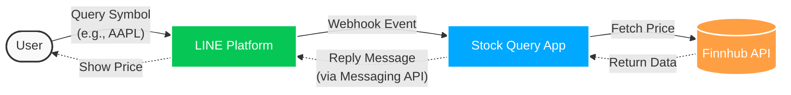

# 📈 Stock Query LINE Bot

A LINE Messaging API bot built with Go that allows users to query real-time stock prices using the Finnhub API.

## ✨ Features

- **Real-time Stock Prices**: Send a stock symbol (e.g., `AAPL`) to the bot, and it queries Finnhub to log and fetch the current, high, and low prices for the day.

## 🏗 Architecture

The project heavily embraces **Clean Architecture** (Hexagonal Architecture) principles to ensure separation of concerns, testability, and maintainability. It uses **Uber Fx** for robust dependency injection and application lifecycle management.



## 📂 Folder Structure

```text
.
├── Makefile        # Commands for running the project
├── README.md       # Project documentation
├── cmd
│   └── api
│       └── main.go # Application entry point (Uber Fx setup)
├── go.mod          # Go module definitions
├── go.sum          # Go module checksums
├── internal        # Private application code
│   ├── adapters    # Infrastructure layer (External APIs, HTTP)
│   │   ├── finnhub_api # Finnhub client implementation
│   │   ├── http    # Echo HTTP server, routes, middleware, and handlers
│   │   │   ├── handlers
│   │   │   ├── middlewares
│   │   │   ├── module.go
│   │   │   ├── route.go
│   │   │   └── server.go
│   │   ├── http_client # Wrapper for Resty HTTP client and Circuit Breaker
│   │   └── line_api    # LINE Messaging API client
│   ├── config      # Configuration loading (Viper)
│   │   ├── config.go
│   │   └── module.go
│   └── core        # Business logic layer (Clean Architecture Core)
│       ├── domain  # Core domain models (Stock, LineEvent)
│       ├── ports   # Interfaces for external dependencies
│       └── usecases # Application business rules
└── pkg             # Public shared utilities
    ├── logger      # Logging configuration (Zap)
    └── utils       # Misc utilities
```

## 🛠 Tech Stack

- **Language**: [Go 1.25+](https://golang.org/)
- **Web Framework**: [Echo v5](https://echo.labstack.com/)
- **Dependency Injection**: [Uber Fx](https://github.com/uber-go/fx)
- **Configuration**: [Viper](https://github.com/spf13/viper)
- **HTTP Client**: [Resty v2](https://github.com/go-resty/resty)
- **Resilience**: Circuit Breaker pattern with [sony/gobreaker](https://github.com/sony/gobreaker)
- **Logging**: [Uber Zap](https://github.com/uber-go/zap)

## 🚀 How to Run

### 1. Prerequisites

- Go 1.25 or higher installed.
- A LINE Official Account and Channel Access Token / Channel Secret.
- A [Finnhub](https://finnhub.io/) API key.

### 2. Configuration

Copy the sample environment file and configure your credentials:

```bash
cp .env.example .env
```

Edit your `.env` and fill in your keys:

```env
PORT=8080

# Finnhub Configuration
FINNHUB_API_KEY=your_finnhub_key
FINNHUB_API_BASE_URL=https://finnhub.io/api/v1

# LINE Configuration
LINE_CHANNEL_SECRET=your_line_channel_secret
LINE_CHANNEL_ACCESS_TOKEN=your_line_channel_access_token
```

_Note: Circuit breaker configurations are also available and defaulted in the `.env.example` file._

### 3. Run the application

Run the bot using the provided Makefile command:

```bash
make run
```

Or use Go directly:

```bash
go run cmd/api/main.go
```

### 4. Setup LINE Webhook

1. The server will start locally at `http://localhost:<PORT>`.
2. Use a tunneling service like [Ngrok](https://ngrok.com/) to expose your local server to the internet.
3. Configure your LINE Bot Webhook URL via the LINE Developer Console to point to your `ngrok` domain (e.g. `https://<YOUR_NGROK_ID>.ngrok.app/webhook`).
